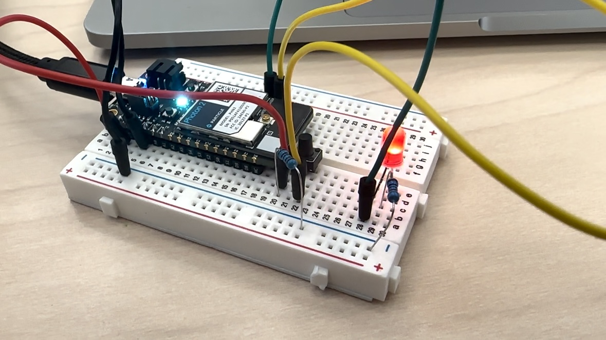
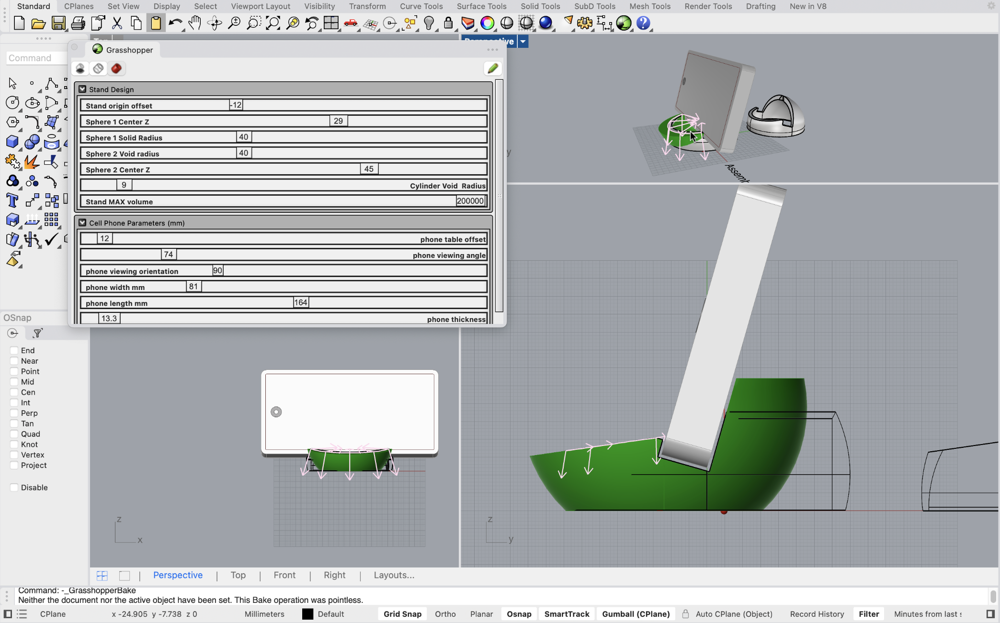

# Outline
[week 1](#week-1-getting-started-with-studio)  
[week 2](#week-2-computational-design-phone-stand)  
[week 3](#week-3-computational-design-project-one)  
[week 4](#week-4-digital-ecosystem-map)  
[week 5](#week-5-particle-io)  
[week 6](#week-6-stemmaqt-system)  
[week 7](#week-7-project-two-progress)
---

# Week 7 Project Two Progress#
## Week of 10/17/2024
This week we started working on our project two. Firstly we revised our proposal - we added the communication between two devices using the cloud function and changed some of the sensor input. Then we worked on the connecting two photons together. We created our group in particle console with our two devices. At first the message cannot be received. We solved this problem by writing "ALL_DEVICES" command. Our initial idea is to use accelerometer sensor in one photon to control the light output in another photon. However we were told that the memory of this board doesn't support such frequent data exchange. So we changed it to a button, which only calls the "publish()" function when it is pressed. During the process we had many challenges with our devices going offline and we didn't find a great solution for that right now. Apart from the communication part, we also tried to light up the Neopixel ring but we could't compile the code in VS Code. We will try the solution posted in slack channel soon.   
  
  

# Week 6 StemmaQT System#
## Week of 10/10/2024
This week I started to work with the stemmaQT module of photon2. Firstly I solder the extension board. Then I connected the stemmaQT board to my photon2 to run the example code. However, I cannot compile my code always get the same error message. Therefore I'm still working on that to fix the problem :(   
  
  

Apart from the stemmaQT, we also get started with the project 2 and we designed the concept and wrote the proposal for project 2.  
  
Update: after uninstalling & uninstalling my particle workbench + reconnecting my photon2 to Berkeley wifi + putting all my code into a folder without blank space, I finally compiled & flashed my code!!! I ran both the accelorameter sensor and the proximity one.  
  
  

# Week 5 Particle IO#
## Week of 10/03/2024
This week I started to use the particle IO as micro-controller. In the first part I finished the setup and configuration of my particle board, and I successfully connect it to the Berkeley IoT network.  
  

For the second part I started to connect different circuits, use different sensors/input and output modules in the kit to run several example code. And I also changed the code and built my own circuit.  
The first circuit is the in-class example of receiving input from switch to change the blinking frequencey of LED.  
  
The second circuit is to use the FSR sensor input to control the color change of RGB LED. I started with the example file, but it took me a while to figure out different pins and adjust sensor input. I use female-male wires for FSR sensor but in the future I would definitely solder it for stable connection.  
  
For the third circuit, I used a potentiometer to control the angle of servo. I referenced two different example files and combined them together. I mapped the input value of potentiometer to write the angle from 0 to 180 in the servo.   
  
Apart from that I do encounter some problems with the file path and re-opening code in particle workbench. I'm trying to fix that problem this week :)

# Week 4 Digital Ecosystem Map #
## Week of 09/26/2024
This week I started with creating a digital ecosystem map of Amazon Go - a smart retailing experience integrated with IoT.
The Amazon Go smart retail ecosystem integrates sensors (like cameras, weight sensors, and RFID), software (including computer vision algorithms, inventory management, and a mobile app), and connectivity (IoT network, Wi-Fi, and cloud computing) to create a seamless shopping experience. As customers enter the store, sensors track their actions, update a virtual shopping cart, and automatically charge their account upon exit. This data flows through real-time processing, enabling inventory management, customer behavior analysis, and continuous system optimization, creating an automated and personalized retail environment.  
  

# Week 3 Computational Design Project One #
## Week of 09/19/2024
### Reflection
This week, my focus was primarily on my computational design project. I designed and 3D-printed a customizable jewelry box integrated with an AirPods holder. The process taught me valuable skills in integrating multiple functionalities into a single product. Specifically, I learned about the importance of ensuring precision in the design phase to guarantee that both the jewelry and AirPods fit perfectly into the compartments.   The learning process involved iterating through several design versions in CAD software to achieve the ideal dimensions and aesthetic. The current state of the project is promising, with a fully functioning prototype that demonstrates the customization aspect and the seamless integration of the AirPods holder.  
### Speculation
Moving forward, I aim to enhance the customization options of the jewelry box by adding features like adjustable compartments or different material finishes to appeal to a broader audience. I’m also considering embedding a small wireless charging pad for AirPods within the holder. This would push the boundaries of practicality and tech integration. From an industry perspective, customizable and multifunctional items are gaining popularity. I recently came across an article discussing modular and customizable designs in 3D-printed products.  

  
  

# Week 2 Computational Design Phone Stand #
## Week of 09/12/2024
This week I started with using Rhino and Grasshopper for computational design project. I learned some tutorials to know the basic interface & command in Rhino and Grasshopper. Based on that I also tried a few things on the example file of the cellphone stand. 
Here's the diagram I draw for the program. Since the program is very complicated for me to understand, reading through the notes of each modules and visaulizing their connections help me better understand how this system works.  
  
  

I also changed many parameters inside the control panel of grasshopper and bake different forms of phone stand. I think this process helps me better understand the advantages of computational design - we can easily generate many variations frm the same piece of code.   

Apart from that I followed some tutorials on youtube to create some basic boxes and perform boolean operation in grasshopper. Here's my progess on that.  

I also tried to replace the nested spheres with other geometric shapes, but I encounter some problems - I figured out which part I should modify and the output do change. However it always indicates that the assembly is not good :(   

# Week 1 Getting Started with Studio #
## Week of 08/29/2024

During my first week at Jacobs, I get familiar with the different machines and tools in the studio. I passed the GSW module and participated in the Form3 Resin Printer workshop. Apart from that I also completed my first laser-cutting project - I downloaded a SVG source file of a simple weaving toolkit from [here](https://www.instructables.com/Laser-Cut-Mini-Frame-Loom-Weaving/). Then I printed it out using the laser-cutting machine with 3mm Plywood. I think this is just a starting point of the studio making and I look forward to exploring other machines and materials in the next few weeks (especially as I start to learn Rhino & Grasshopper)! 

---

## Quick Links ##

- [TDF Wiki](https://github.com/Berkeley-MDes/24f-desinv-202/wiki) - the ultimate source for truth and information about the course and assignments
- [Google Drive Folder](https://drive.google.com/drive/u/0/folders/1DJ1b6sSDwHXX6NRcQYt10ivyQSgU0ND6) - slides and other resources
- [bCourses](https://bcourses.berkeley.edu/courses/1537533) - where the grading happens
